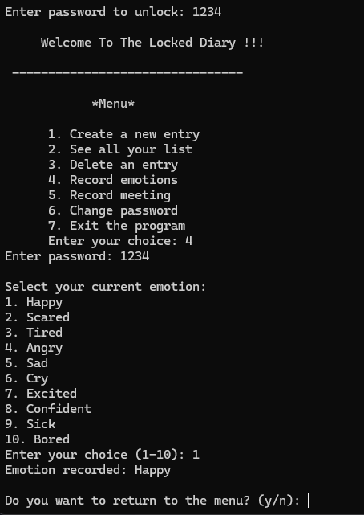

# The Locked Diary (C++ OOP Practice Project)

โปรเจคแอปพลิเคชันไดอารี่ส่วนตัวแบบล็อกรหัสผ่าน (Console-based Application) พัฒนาขึ้นโดยใช้ภาษา C++ เพื่อฝึกฝนทักษะการออกแบบสถาปัตยกรรมซอฟต์แวร์ด้วยแนวคิด **Object-Oriented Programming (OOP)** ---

## 🌟 คุณสมบัติของระบบ (Features)
- **Password Protection System:** ระบบล็อกไดอารี่ด้วยรหัสผ่านความปลอดภัยสูง ตรวจสอบสิทธิ์ (Authentication) ทุกครั้งก่อนเข้าถึงเมนูจัดการข้อมูล
- **Diary Management:** รองรับการบันทึกข้อมูลไดอารี่ทั่วไป (เพิ่มหัวข้อ, วันที่ และเนื้อหา), แสดงรายการไดอารี่ทั้งหมด และเลือกนำไดอารี่ที่ต้องการออกได้ (Delete Entry)
- **Specialized Loggers:** ฟังก์ชันบันทึกข้อมูลหมวดหมู่เฉพาะตัว:
  - **Record Emotions:** เลือกบันทึกสถานะอารมณ์ปัจจุบันจาก Quick Menu (มีตัวเลือกอารมณ์พร้อม Emoji ถึง 10 รูปแบบ เช่น Happy 😊, Tired 😓, Confident 😎)
  - **Record Meeting:** เมนูแยกสำหรับจดบันทึกรายละเอียดการประชุมหรือการนัดหมายสำคัญ
- **Dynamic Settings:** มีฟังก์ชันสำหรับเปลี่ยนรหัสผ่านเพื่อความปลอดภัย (Change Password) ได้โดยตรงจากภายในโปรแกรม

---

## 🛠️ แนวคิด OOP ที่ใช้ในโปรเจค (Object-Oriented Concepts)
โครงสร้างโปรแกรมนี้ถูกออกแบบขึ้นโดยใช้คุณสมบัติหลักของ OOP อย่างครบถ้วน:
- **Encapsulation:** มีการแยกส่วนข้อมูลเป็น `private` และ `protected` และเรียกใช้งานผ่านฟังก์ชัน Getter/Setter เพื่อความปลอดภัยของข้อมูล
- **Inheritance (การสืบทอดคุณสมบัติ):** - Class `Diary` สืบทอดคุณสมบัติมาจาก Class `DiaryEntry`
  - Class `LockedDiary` สืบทอดคุณสมบัติหลักมาจาก Class `Diary` อีกทอดหนึ่งเพื่อประยุกต์ระบบความปลอดภัยล็อกรหัสผ่าน
- **Polymorphism & Method Overriding:** มีการใช้งานฟังก์ชันเสมือน (`virtual void`) และใช้โครงสร้าง `override` ในคลาสลูกเพื่อปรับเปลี่ยนรูปแบบการทำงานให้เข้ากับเงื่อนไขของระบบล็อกรหัสผ่าน

---

## 📂 โครงสร้างโปรเจค (Project Structure)
โปรเจคนี้จัดเก็บผ่านเครื่องมือ Code::Blocks IDE โดยมีโครงสร้างไฟล์หลักดังนี้:
  ```text
The Locked Diary/
├── bin/Debug/        # โฟลเดอร์เก็บไฟล์ Executable หลังการ Build
├── obj/Debug/        # โฟลเดอร์เก็บไฟล์ Object ชั่วคราวของคอมไพเลอร์
├── main.cpp          # ซอร์สโค้ดหลักของโปรแกรม C++ ทั้งหมด
├── pj.cbp            # ไฟล์โปรเจคหลักของ Code::Blocks (Project File)
├── pj.depend         # ไฟล์บันทึก Dependency การเชื่อมโยงโค้ด
└── pj.layout         # ไฟล์บันทึกการจัดวางหน้าจอและ Layout ใน IDE
```
## 🚀 วิธีการคอมไพล์และรันใช้งาน (Getting Started)
- Prerequisites
  - แนะนำให้ใช้เครื่องมือ Code::Blocks IDE ในการเปิด หรือคอมไพเลอร์ที่รองรับ C++11 ขึ้นไป (เช่น GCC)
ขั้นตอนการรันผ่าน Command Line
1. เปิด Terminal หรือ Command Prompt ในโฟลเดอร์โปรเจค
2. คอมไพล์ซอร์สโค้ดด้วยคำสั่ง GCC:
   - g++ main.cpp -o locked_diary
3. เริ่มต้นรันโปรแกรม:
   - Windows: locked_diary.exe
   - Mac/Linux: ./locked_diary
  
## 💡 ตัวอย่างการทดสอบระบบ (Test Cases)
1. เริ่มต้นเข้าใช้งาน: ระบบจะถามรหัสผ่าน ให้ป้อนรหัสเริ่มต้นที่ตั้งไว้เพื่อปลดล็อกเข้าสู่หน้าจอเมนูหลัก (Welcome To The Locked Diary !!!)
2. การบันทึกสถานะอารมณ์ (Record Emotions): เลือกเมนูหมายเลข 4 ระบบจะแสดงรายการอารมณ์ 1-10 ให้ป้อนหมายเลขเพื่อทำการบันทึก
3. การออกจากระบบ: เลือกเมนูหมายเลข 7 เพื่อปิดโปรแกรมอย่างปลอดภัย
   
  

โปรเจคนี้พัฒนาขึ้นเพื่อวัตถุประสงค์ในการศึกษาโครงสร้างและการทำงานเชิงวัตถุ (OOP) ของภาษา C++
